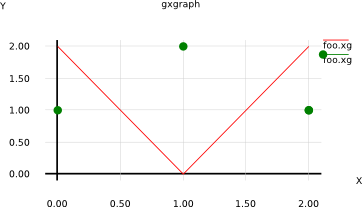

# Background

gxgraph is a port of the legendary x11 program xgraph to gtk. 

This new version (Dec 2012) uses antialiased graphics through cairo.

# Syntax

The syntax of datasets in gxgraph is a mixture of xgraph and giv.

Here is an example of a gxgraph file:

    $color red
    0 2 
    1 0
    2 2
    
    $color green
    $marks fcircle
    $noline
    $mark_size 10
    0 1

Result:

    
  
# Development

For sources and bug tracking see: https://github.com/dov/gxgraph

# References:

* http://www.mrtc.mdh.se/~icc/SDE/5.0-0/doc/RefMan/xgraph.html
* http://www.xgraph.org/
* http://giv.sourceforge.net/giv/

# Authors

* Dov Grobgeld <dov.grobgeld@gmail.com>
